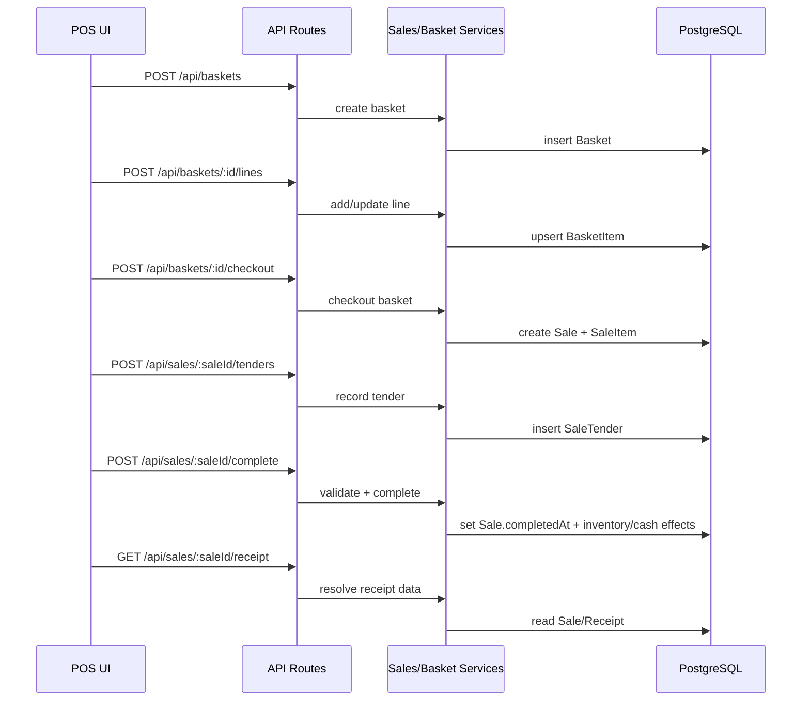

# CorePOS Architecture

## High-level system overview
CorePOS is a Node.js + TypeScript EPOS platform for bike retail operations. It supports:

- POS basket-to-sale checkout with tenders and receipts
- Workshop jobs (booking, execution, parts/labour lines, reservations, conversion to sale)
- Inventory movement ledger with on-hand/available calculations
- Purchasing, receiving, stocktake, cash/till, customers, refunds, reports, admin, and audit

Primary stack:

- Runtime: Express 5 + TypeScript
- Data access: Prisma + PostgreSQL
- Auth: cookie/JWT-based staff auth with role guards
- UI: server-rendered pages mounted from Express routes

## Component diagram (Mermaid)
```mermaid
flowchart LR
  Staff[Staff/Manager/Admin Browser]
  Public[Public Booking Client]

  Staff --> UI[Server-rendered UI Routes]
  Staff --> API[REST API Routes]
  Public --> BookingAPI[/api/workshop-bookings]

  UI --> API
  API --> MW[Middleware: auth + role guard + error handler]
  MW --> Controllers[Controllers]
  Controllers --> Services[Domain Services]
  Services --> Prisma[Prisma Client]
  Prisma --> PG[(PostgreSQL)]

  Services --> Reports[CSV/Reporting Utilities]
  API --> Print[Printable Views: receipts/workshop]
```

## Main services
Core business logic lives under `src/services` and is used by controllers.

- `salesService.ts`, `basketService.ts`, `receiptService.ts`, `refundService.ts`
- `inventoryLedgerService.ts`, `stockService.ts`, `stocktakeService.ts`, `stockReservationService.ts`
- `workshopService.ts`, `workshopWorkflowService.ts`, `workshopCheckoutService.ts`, `workshopBookingService.ts`, `workshopMoneyService.ts`
- `purchasingService.ts`, `cashService.ts`, `tillService.ts`
- `customerService.ts`, `productService.ts`, `locationService.ts`
- `reportService.ts`, `workshopReportService.ts`, `adminExportService.ts`
- `auditService.ts`, `authService.ts`, `authTokenService.ts`, `adminUserService.ts`

## Request flow: POS sale lifecycle
Typical POS flow combines baskets and sales endpoints.

1. Create basket: `POST /api/baskets`
2. Add/update/remove basket lines: `/api/baskets/:id/items` (or `/lines` aliases)
3. Checkout basket to draft sale: `POST /api/baskets/:id/checkout`
4. Add tenders: `POST /api/sales/:saleId/tenders`
5. Complete sale: `POST /api/sales/:saleId/complete`
6. Issue/fetch receipt: `POST /api/receipts/issue`, `GET /api/sales/:saleId/receipt`, printable via `/r/:saleOrReceiptRef`



## Workshop lifecycle
Workshop jobs are stored in `WorkshopJob` and orchestrated by `workshopService.ts` + `workshopWorkflowService.ts`.

Enum statuses (Prisma `WorkshopJobStatus`):

- `BOOKING_MADE`
- `BIKE_ARRIVED`
- `WAITING_FOR_APPROVAL`
- `APPROVED`
- `WAITING_FOR_PARTS`
- `ON_HOLD`
- `BIKE_READY`
- `COMPLETED`
- `CANCELLED`

Workflow service normalizes transitions by stage:

- `BOOKED -> IN_PROGRESS -> READY -> COMPLETED`
- `CANCELLED` is allowed from any stage
- If a linked sale exists, completion requires that sale to be completed
- Cancellation releases stock reservations for the job

Workshop billing path:

- Add labour/part lines on job (`WorkshopJobLine`)
- Optional stock reservation (`StockReservation`)
- Convert to sale (`POST /api/workshop/jobs/:id/convert-to-sale`)
- Complete sale through standard sales flow

## Inventory ledger model
Inventory is event-sourced via `InventoryMovement` plus reservation overlays.

Core records:

- `InventoryMovement` stores immutable quantity deltas (`quantity`) and `type`
- `StockReservation` tracks reserved quantity per workshop job/variant
- `Stocktake` + `StocktakeLine` drive adjustment operations

Calculation model used by inventory services:

- `onHand = SUM(InventoryMovement.quantity) by variant`
- `reservedQty = SUM(StockReservation.quantity) by variant`
- `availableQty = onHand - reservedQty`

Relevant movement types (`InventoryMovementType`):

- `PURCHASE_RECEIPT`, `PURCHASE`, `SALE`, `ADJUSTMENT`, `WORKSHOP_USE`, `RETURN`

